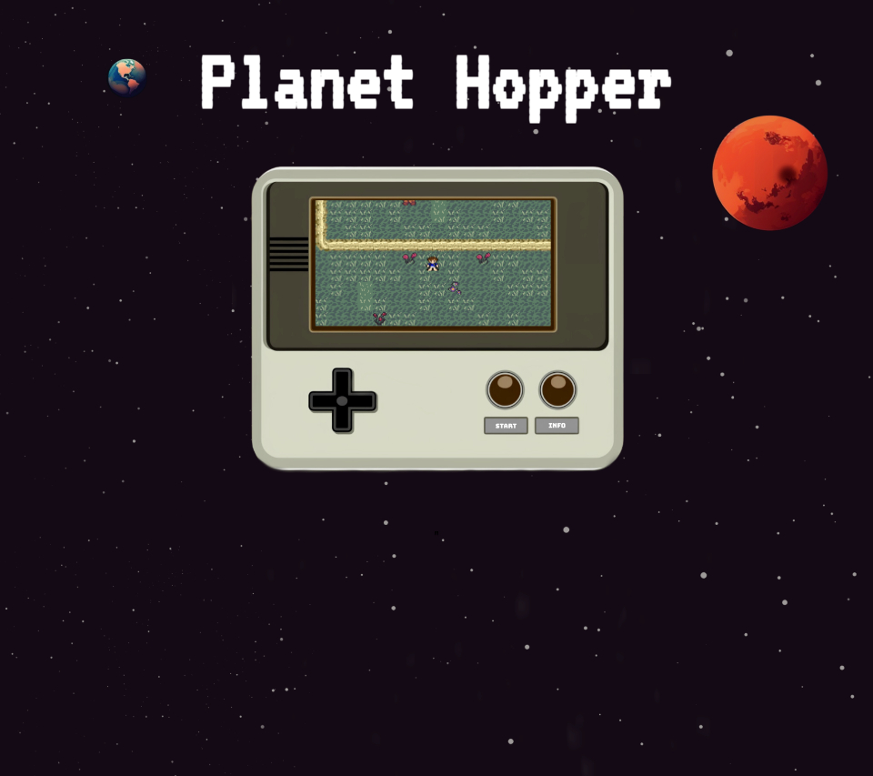

# Planet-Hopper

Get ready to engage in captivating and meaningful conversations as you journey through this extraordinary game world, where NPCs come to life through the power of AI dialogue.

"From a distant corner of the universe , Barf, an outcast on his home planet, embarks on an extraordinary journey to save his dying world. His planet is facing a grave crisis as the once-thriving plants wither away, causing oxygen levels to plummet. His dreams of being an astronaut are realized in a fragmented ship, with a scribbled map, on a mission of hope.
Barf successfully makes it to his destination, but not without damaging his craft and losing his pants in the process.

On his quest, Barf encounters a diverse cast of characters, each with their own unique stories and needs. They may seem reluctant to trade, but Barf must navigate the complexities of interplanetary trade, and demonstrate his resourcefulness to secure necessary items. His mission depends on offering the perfect trade to win their cooperation.  As he gathers the items required to breathe life back into his planet Barf’s heroism shines, transcending the limitations of his outcast origins.

## Innovation

One of the remarkable features of our application is the integration of an advanced AI dialogue system, powered by open AI. This innovative addition allows players to engage in dynamic and immersive conversations with the non-playable characters (NPCs) in the game.
Through the AI dialogue system, players can interact with the NPCs using natural language, just like having a conversation with a real person. The power of machine learning ensures that the NPC’s responses evolve over time. 

## Features:

 - Enhanced gameplay experience
 - Immersive conversations and interactions
 - AI-generated responses to player inputs

## Team Members:

- J Seybold
- Will Cline
- Edward Wells
- Yevette Hunt

## Motivation:

We wanted to create a unique gameplay experience, beyond traditional combat or puzzle-solving mechanics and wrap it around an engaging story that the player could become invested in.

## Tools and Utilities:

- MySql
- OpenAI API
- Tiles
- Midjourney
- Handlebars

## Future Improvements:

Expand the game world with hidden treasures, secret areas, and undiscovered locations.
Allow players to gather resources and craft their own items or enhance existing ones. 
Develop friendships, romances, or rivalries with NPCs. By engaging in dialogue, completing character-specific quests, and making choices that align with NPC values, players can deepen relationships. This can lead to unique storylines, special rewards, or unlock NPC companions.

## Acknowledgements:

credits

## Contact:
   - J Seybold https://github.com/clever-girl31
   - Will Cline https://github.com/willrcline
   - Edward Wells https://github.com/edwardwells87
   - Yevette Hunt https://github.com/yveivy

## Deployed Site:
https://planet-hopper.herokuapp.com/

